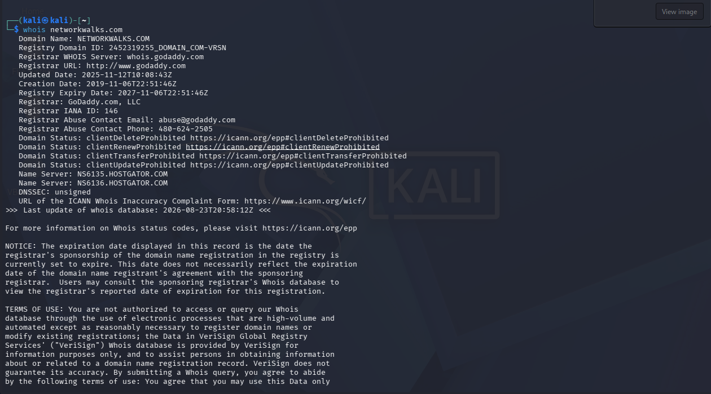
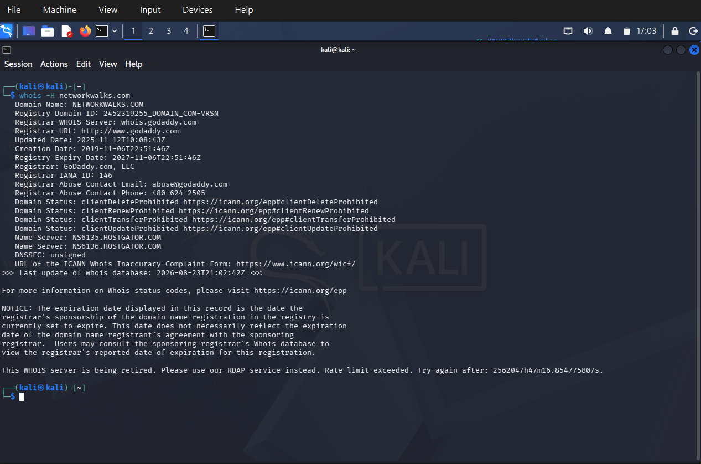
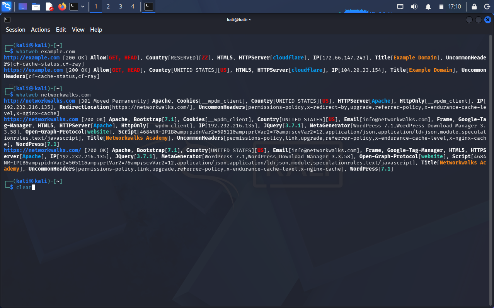
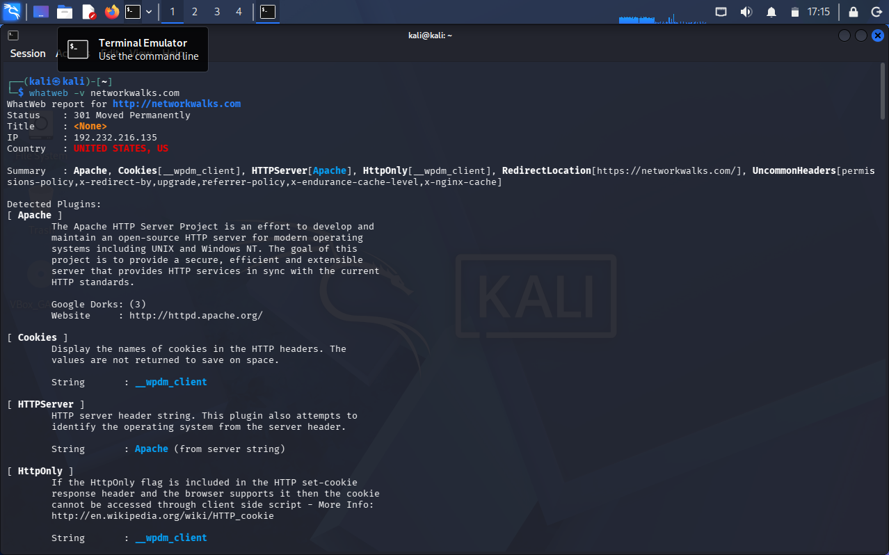
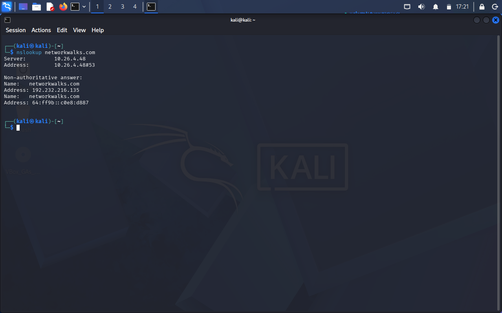
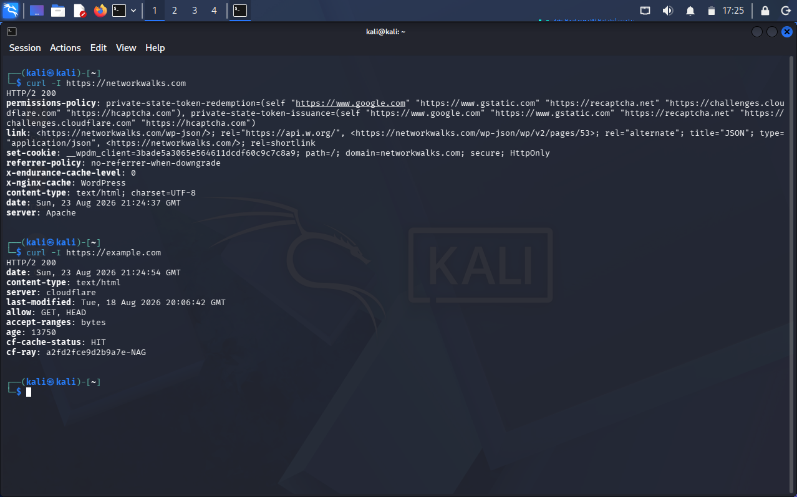
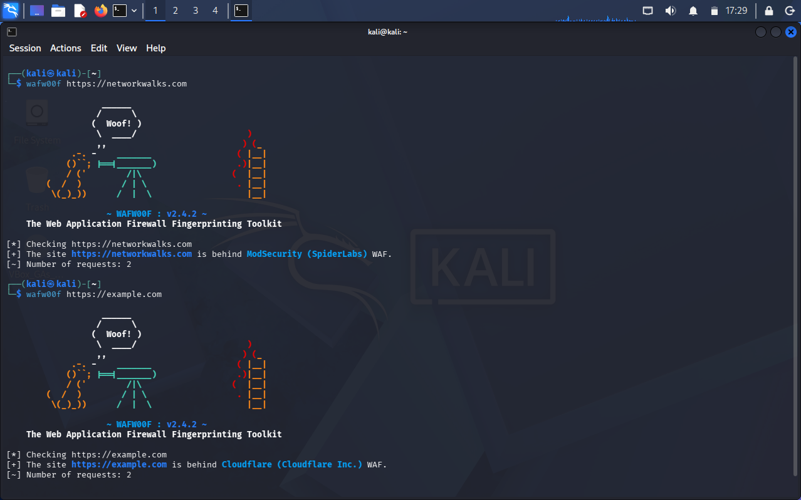
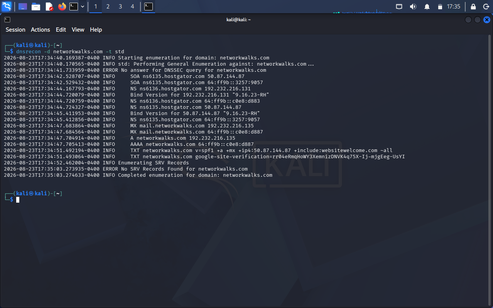

# 🔍 Week 2 — Footprinting, Scanning & Report Writing

> **NetworkWalks Academy | Batch B082 | August 2026**
>
> **Track:** Offensive (Red Team) — Phase 1 (Reconnaissance) & Phase 2 (Scanning)
>
> **Submission Deadline:** 23:00H, Friday 28-August-2026

---

## 📋 Project Overview

Week 2 focuses on the foundational phases of ethical hacking and penetration testing: **Footprinting (Reconnaissance)** and **Network Scanning**. Using Kali Linux tools and Zenmap/Nmap, we systematically gather open-source intelligence (OSINT), fingerprint web infrastructures, discover live hosts on our network, map active services, and compile a client-ready **Penetration Testing Report (W2-PM-FINAL)**.

```
+---------------------------------------------------------------------------------------+
|                                5 PHASES OF HACKING                                    |
+---------------------------------------------------------------------------------------+
|  [01. FOOTPRINTING]  ->  [02. SCANNING]  ->  [03. GAINING ACCESS]                     |
|  Gather OSINT & Data     Find Open Ports     Password Cracking / Exploitation         |
|                                                                                       |
|                                          ->  [04. MAINTAINING ACCESS]                 |
|                                              Backdoors & Persistence                  |
|                                                                                       |
|                                          ->  [05. CLEARING LOGS]                      |
|                                              Anti-forensics & Log Removal             |
|                                                                                       |
|  [06. REPORTING] ===> Comprehensive Penetration Testing Documentation (W2-PM-FINAL)   |
+---------------------------------------------------------------------------------------+
```

---

## 📦 Project Modules & Status

| Module ID | Module Name | Category | Scope | Status | Deliverables |
|---|---|:---:|---|:---:|---|
| **W2-PM1** | Multi-Tool Kali Footprinting | **Elective** | 6 Kali tools (`whois`, `whatweb`, `nslookup`, `curl`, `wafw00f`, `dnsrecon`) | ✅ Completed | [View Tasks](#-w2-pm1-footprinting-with-multiple-kali-tools) |
| **W2-PM2** | Google Hacking Database (GHDB) | Elective | Google Dorks & search operator reconnaissance | 📚 Documented | [View Section](#-w2-pm2-ghdb-based-footprinting-attacks) |
| **W2-PM3** | Maltego Reconnaissance | Elective | Graph-based entity link analysis & transforms | 📚 Documented | [View Section](#-w2-pm3-maltego-based-footprinting-attacks) |
| **W2-PM4** | theHarvester OSINT | Elective | Email, domain, subdomain & IP enumeration | 📚 Documented | [View Section](#-w2-pm4-theharvester-based-footprinting-attacks) |
| **W2-PM5** | **Zenmap / Nmap Scanning** | **Essential** | Host discovery, port scanning, OS/service detection, topology | ✅ Completed | [View Section](#-w2-pm5-zenmap--nmap-network-scanning-essential) \| [📥 Zenmap Report](../Reports/Week2_Zenmap_Report.docx) |
| **W2-PM-FINAL** | **Formal Pentest Report** | **Essential** | Client-ready vulnerability report (`.docx` & `.md`) | ✅ Completed | [📄 Markdown Report](../Reports/Week2_Pentest_Report.md) \| [📥 DOCX Report](../Reports/Week2_Footprinting_Reconnaissance_Report.docx) |

---

## 🔬 W2-PM1: Footprinting with Multiple Kali Tools

Target: Authorized domain **`networkwalks.com`** | Comparison: **`example.com`**

---

### Task 1: Domain Registration Lookup (`whois`)
`whois` queries public registry databases that store domain registration details (registrar, creation/expiry dates, name servers, contact details).

```bash
# Standard lookup
whois networkwalks.com

# Suppress legal disclaimer text for clean output
whois -H networkwalks.com
```


*Figure 1: WHOIS output showing registrar (GoDaddy), creation/expiry dates, and name servers.*


*Figure 2: WHOIS output with `-H` flag suppressing legal disclaimers.*

- **Key Findings:** Domain registered via `GoDaddy.com, LLC`; Created: `06 Nov 2019`; Expires: `06 Nov 2027`; Name servers hosted on HostGator (`ns6135` / `ns6136.hostgator.com`); Domain status locks (`clientDeleteProhibited`, `clientTransferProhibited`, `clientUpdateProhibited`) are all active.

---

### Task 2: Web Technology Fingerprinting (`whatweb`)
`whatweb` identifies CMS platforms, web server daemons, programming languages, and JavaScript libraries.

```bash
# Compare target vs baseline
whatweb example.com
whatweb networkwalks.com

# Verbose plugin breakdown
whatweb -v networkwalks.com
```


*Figure 3: WhatWeb comparison between example.com (Cloudflare-fronted) and networkwalks.com (Apache + WordPress stack).*


*Figure 4: Verbose WhatWeb report detailing plugins, cookie security, and HTTP attributes.*

- **Key Findings:** Running Apache on IP `192.232.216.135`, **WordPress 7.1**, **WP Download Manager (v3.58)**, Bootstrap 7.1, jQuery 3.7.1, and session cookie `__wpdm_client` with `Secure` and `HttpOnly` attributes.

---

### Task 3: DNS Name Resolution (`nslookup`)
`nslookup` queries DNS servers to resolve a domain name to its IP addresses.

```bash
nslookup networkwalks.com
```


*Figure 5: nslookup resolving networkwalks.com to IPv4 address 192.232.216.135 and NAT64 IPv6 address.*

- **Key Findings:** Resolved `networkwalks.com` to IPv4 `192.232.216.135` and associated NAT64 IPv6 address.

---

### Task 4: HTTP Header & Endpoint Inspection (`curl -I`)
Sends an HTTP `HEAD` request to inspect response headers without downloading the page body.

```bash
curl -I https://networkwalks.com
curl -I https://example.com
```


*Figure 6: HTTP response headers for networkwalks.com vs example.com.*

- **Key Findings:** Discloses `Server: Apache`, WordPress cache headers (`x-nginx-cache: WordPress`), session cookie `__wpdm_client`, and exposed WordPress REST API Link: `<https://networkwalks.com/wp-json/>; rel="https://api.w.org/"`.

---

### Task 5: Web Application Firewall Detection (`wafw00f`)
Detects whether a website sits behind a Web Application Firewall (WAF) and identifies the vendor.

```bash
wafw00f https://networkwalks.com
wafw00f https://example.com
```


*Figure 7: wafw00f detecting ModSecurity (SpiderLabs) on networkwalks.com and Cloudflare WAF on example.com.*

- **Key Findings:** `networkwalks.com` is protected by **ModSecurity (SpiderLabs)** WAF; `example.com` is protected by **Cloudflare WAF**.

---

### Task 6: Full DNS Record Enumeration (`dnsrecon`)
Automates the retrieval of all DNS record types (SOA, NS, MX, A, AAAA, TXT, SPF) in a single pass.

```bash
dnsrecon -d networkwalks.com -t std
```


*Figure 8: dnsrecon output showing SOA, NS, MX, A, AAAA, and TXT SPF records.*

- **Key Findings:** SOA & NS records point to HostGator (`ns6135`/`ns6136`, BIND 9.16.23-RH); MX routes to `mail.networkwalks.com`; TXT records contain SPF policy (`v=spf1 +a +mx +ip4:50.87.144.87 +include:websitewelcome.com ~all`) and Google Search Console verification. DNSSEC is unsigned.

---

## 📊 Findings Summary: Target vs Comparison

| Category | `networkwalks.com` | `example.com` (Comparison) |
|---|---|---|
| **Registrar** | GoDaddy.com, LLC | N/A (ICANN reserved) |
| **Hosting / Name Servers** | HostGator (`ns6135` / `ns6136`) | Cloudflare Edge / Anycast |
| **Web Server** | Apache (Nginx cache proxy) | Cloudflare (Edge) |
| **CMS / Stack** | WordPress 7.1, Bootstrap 7.1, jQuery 3.7.1 | Static page, no CMS detected |
| **Active Plugins** | WP Download Manager (v3.58) | None |
| **Public IP** | `192.232.216.135` | `172.66.147.243` / `104.20.23.154` |
| **WAF Detected** | **ModSecurity (SpiderLabs)** | **Cloudflare WAF** |
| **Notable Cookies** | `__wpdm_client` (`Secure`, `HttpOnly`) | None observed |
| **DNSSEC** | Unsigned | Not queried |

---

## 🔎 W2-PM2: GHDB-based Footprinting Attacks

> **Resource:** [Google Hacking Database (GHDB) on Exploit-DB](https://www.exploit-db.com/google-hacking-database)

| Category | Dork Syntax | Security Significance |
|---|---|---|
| **Subdomain Discovery** | `site:networkwalks.com -www` | Finds forgotten staging/dev subdomains |
| **Exposed Documents** | `site:networkwalks.com filetype:pdf OR filetype:docx` | Identifies public manuals, invoices, or briefs |
| **Config / Backup Files** | `site:networkwalks.com ext:env OR ext:sql OR ext:bak` | Locates database dumps, environment secrets |
| **Admin Login Portals** | `site:networkwalks.com inurl:login OR inurl:admin` | Maps entry points for credential attacks |
| **Directory Indexing** | `site:networkwalks.com intitle:"index of /"` | Uncovers unprotected file directory listings |

---

## 🌐 W2-PM3: Maltego-based Footprinting Attacks

- **Workflow:** Entity link analysis starting from domain `networkwalks.com`, executing transforms to discover DNS names, IP blocks, Netblocks, and organizational email addresses.

---

## 🌾 W2-PM4: theHarvester-based Footprinting Attacks

```bash
theHarvester -d networkwalks.com -b all -l 100
```
- Harvests public corporate emails, employee names, search engine subdomains, and public IP ranges.

---

## 📡 W2-PM5: Zenmap & Nmap Network Scanning (Essential)

> **Resources:**
> - [Download Nmap / Zenmap Official](https://nmap.org/download.html)
> - [Lab Practice — Zenmap Network Scanning Guide](https://networkwalks.com/lab-practice-network-scanning-with-zenmap/)
> - [Authorized Practice Target: scanme.nmap.org](http://scanme.nmap.org/)

<details>
<summary><strong>📖 Nmap Cheatsheet (NetworkWalks Series)</strong> — click to expand</summary>

#### 1. Target Selection
| Switch / Syntax | Example | Description |
|---|---|---|
| `nmap [IP]` | `nmap 10.0.0.1` | Scan a single IP |
| `nmap [Host]` | `nmap www.networkwalks.com` | Scan a domain / hostname |
| `nmap [Range]` | `nmap 10.0.0.1-99` | Scan a range of IP addresses |
| `nmap [Multiple]` | `nmap 10.0.0.1,10.0.0.2` | Scan multiple distinct IPs |
| `nmap [Subnet]` | `nmap 10.0.0.0/24` | Scan an entire CIDR subnet |
| `nmap -iL [File]` | `nmap -iL LIST1.txt` | Scan targets from a text file |
| `nmap --exclude` | `nmap 10.0.0.0/24 --exclude 10.0.0.1` | Exclude specific targets from scan |

#### 2. Target Scan Options
| Switch | Example | Description |
|---|---|---|
| `-sS` | `nmap 10.0.0.1 -sS` | **SYN Scan** (TCP Half-Open / Stealth Scan, default with root) |
| `-sT` | `nmap 10.0.0.1 -sT` | **TCP Connect Scan** (Full 3-way handshake, no root needed) |
| `-sA` | `nmap 10.0.0.1 -sA` | **ACK Scan** (Maps firewall rulesets and filtered ports) |
| `-sF` | `nmap 10.0.0.1 -sF` | **FIN Scan** (Sends FIN packet to elicit RST from closed ports) |
| `-sU` | `nmap 10.0.0.1 -sU` | **UDP Scan** (DNS, DHCP, SNMP, NTP service discovery) |
| `-sX` | `nmap 10.0.0.1 -sX` | **Xmas Scan** (Sets FIN, URG, and PUSH flags) |
| `-sL` | `nmap 10.0.0.1 -sL` | **List Scan** (Lists targets without sending packets to hosts) |
| `-sP` / `-sn` | `nmap -sn 10.0.0.0/24` | **Ping Scan** (Host discovery only, no port scan) |
| `--traceroute` | `nmap --traceroute 10.0.0.1` | Trace network hop path to target host |
| `-A` | `nmap 10.0.0.1 -A` | **Aggressive Scan** (OS detection, version detection, scripts, traceroute) |
| `-6` | `nmap -6 [IPv6-Address]` | IPv6 network scan |
| `-F` | `nmap 10.0.0.1 -F` | **Fast Scan** (Scans the top 100 most common ports) |

#### 3. Selection of Ports to Scan
| Switch | Example | Description |
|---|---|---|
| `-p [port]` | `nmap 10.0.0.1 -p 21` | Scan a single port (FTP) |
| `-p [p1,p2]` | `nmap 10.0.0.1 -p 21,22` | Scan specific individual ports |
| `-p [p1-p2]` | `nmap 10.0.0.1 -p 1-1000` | Scan a custom port range |
| `-p [service]` | `nmap 10.0.0.1 -p ssh,http` | Scan ports by service name |
| `-p-` | `nmap 10.0.0.1 -p-` | **Scan all 65,535 TCP ports** |

#### 4. Target Version & OS Fingerprinting
| Switch | Example | Description |
|---|---|---|
| `-O` | `nmap 10.0.0.1 -O` | **Remote Operating System Detection** |
| `-sV` | `nmap 10.0.0.1 -sV` | **Service Version Detection** (Queries open ports for version banners) |
| `--version-intensity` | `nmap -sV --version-intensity 9 10.0.0.1` | Set probing intensity level (0 to 9) |

#### 5. Scan Speed & Timing Options
| Switch | Speed Profile | Description |
|---|---|---|
| `-T0` | Paranoid | Extremely slow, serial probing for IDS/IPS evasion |
| `-T1` | Sneaky | Slow scan for stealthy network reconnaissance |
| `-T2` | Polite | Slows scan down to consume less bandwidth on target |
| `-T3` | Normal | Default Nmap timing template |
| `-T4` | Aggressive | Faster speed, recommended for reliable lab networks |
| `-T5` | Insane | Maximum speed, less accurate, easily detectable |

#### 6. Miscellaneous & Output Options
| Switch | Example | Description |
|---|---|---|
| `-oN [file]` | `nmap -oN output.txt 10.0.0.1` | Save output in human-readable normal format |
| `-oX [file]` | `nmap -oX output.xml 10.0.0.1` | Save scan output in XML format |
| `-oA [basename]`| `nmap -oA lab_scan 10.0.0.1` | Save in all three major formats (Nmap, XML, Grepable) |
| `-S [IP]` | `nmap -S 10.0.0.99 10.0.0.1` | Spoof source IP address |
| `-e [interface]`| `nmap -e eth0 10.0.0.1` | Specify network interface |
| `--spoof-mac` | `nmap --spoof-mac 00:11:22:33:44:55 10.0.0.1` | Spoof MAC address |
| `--script` | `nmap --script vuln 10.0.0.1` | Execute Nmap Scripting Engine (NSE) scripts |

</details>

---

### 🖥️ Local Network Scanning Steps with Zenmap

1. **Identify Local Network Configuration:**
   ```cmd
   ipconfig /all
   ```
2. **Execute Ping Discovery Sweep in Zenmap:**
   - Command: `nmap -sn 10.0.0.0/24` (or `10.0.2.0/24` in lab VM)
   - Live Hosts Discovered: `10.0.0.1`, `10.0.0.4`, `10.0.0.5`, `10.0.0.19`.
3. **Generate & Save Topology Diagram:**
   - Navigated to the **Topology** tab in Zenmap.
   - Enabled interactive Legend and exported the graphical network map in PDF/graphic format.

---

## 📄 W2-PM-FINAL: Penetration Testing Reports

The formal deliverables for Week 2 are available in the [`Reports/`](../Reports/) directory:

- 📄 **[Week 2 Penetration Testing Report (Markdown)](../Reports/Week2_Pentest_Report.md)**
- 📥 **[Week 2 Footprinting & Reconnaissance Report (DOCX)](../Reports/Week2_Footprinting_Reconnaissance_Report.docx)**
- 📥 **[Week 2 Zenmap Scanning Report (DOCX)](../Reports/Week2_Zenmap_Report.docx)**

---

## 💡 What I Learned

1. **Passive vs Active Reconnaissance:** Passive tools (`whois`, `nslookup`, `dnsrecon`) reveal immense infrastructure intelligence without alerting target IDS systems.
2. **Web Stack Fingerprinting:** Active tools (`whatweb`, `curl -I`, `wafw00f`) uncover exact software versions, cache proxies, and firewall perimeters.
3. **Network Discovery & Topology:** Zenmap allows rapid subnet sweep and visual mapping of active devices.
4. **Professional Documentation:** Translating technical observations into risk matrices, severity levels, and actionable remediations.

---

## ⚖️ Ethical Statement

> All activities were performed strictly within **authorized educational boundaries** (`networkwalks.com` with permission, and personal private subnet `10.0.0.0/24` / `10.0.2.0/24`). Unauthorized reconnaissance or scanning against third-party systems is strictly prohibited.

---

> 📂 [Back to Main README](../README.md)
